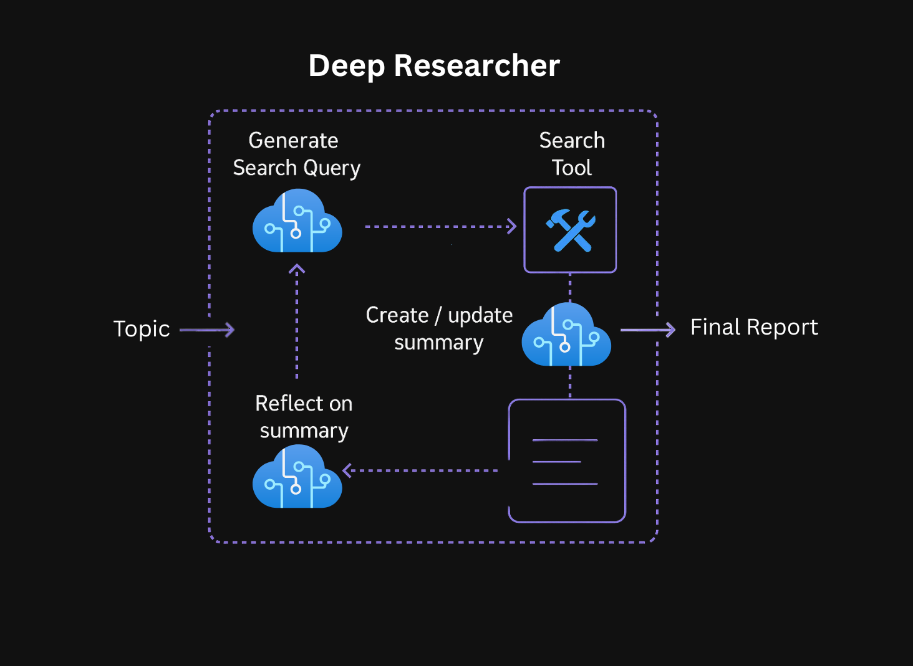

# Build25 LAB331 - Deep Research with LangChain and DeepSeek R1

## Description

In this hands-on workshop, you'll learn how **Reasoning Models**, like DeepSeek R1 work and how to use them for deep research. 

### The complete iterative deep research process includes:

1. **Query Generation**: Query generation based on the users research topic input 
2. **Web Search**: Searching the web based on the generated query
3. **Summarization**: Summarization of the web search results into a report
4. **Knowledge Gap Identification**: Reflection on the summary and identification of specific knowledge gaps to fill
5. **Follow-up search cycles**: Iterative search and reflection cycles based on identified gaps
6. **Final Report**: Synthesis of all findings into a comprehensive report

## What You'll Learn

This workshop has been built to teach you foundational concepts for using reasoning models. To view the full application code see the [Deep Research Azure Sample](https://github.com/Azure-Samples/deepresearch). For a more in depth understanding of how reasoning models work read [this article](https://techcommunity.microsoft.com/blog/azure-ai-services-blog/everything-you-need-to-know-about-reasoning-models-o1-o3-o4-mini-and-beyond/4406846). 

### By the end of this workshop, you'll have learnt:

- What a reasoning model is and how to use DeepSeek R1
-  How to use reasoning models with tools like [Tavily](https://app.tavily.com) web search for optimum search results
- What [LangGraph](https://www.langchain.com/langgraph) is and how to implement reflection style archictecture with it
- How to use LangGraph to perform iterative research cycles to build comprehensive knowledge
- How to deploy the final application

## Workshop Structure

The workshop is organized into four labs:

1. **[Introduction to Reasoning Models](./docs/docs/lab-1-introduction-to-reasoning-models.md)**
2. **[Web Research Integration](./docs/docs/lab-2-web-research.md)**
3. **[Research Reflection](./docs/docs/lab-3-reflection.md)**
4. **[Launching Your Researcher](./docs/docs/lab-4-launch-researcher.md)**

## Content Owners

Marlene Mhangami, Senior Developer Advocate at Microsoft

## Contributing

This project welcomes contributions and suggestions.  Most contributions require you to agree to a
Contributor License Agreement (CLA) declaring that you have the right to, and actually do, grant us
the rights to use your contribution. For details, visit https://cla.opensource.microsoft.com.

When you submit a pull request, a CLA bot will automatically determine whether you need to provide
a CLA and decorate the PR appropriately (e.g., status check, comment). Simply follow the instructions
provided by the bot. You will only need to do this once across all repos using our CLA.

This project has adopted the [Microsoft Open Source Code of Conduct](https://opensource.microsoft.com/codeofconduct/).
For more information see the [Code of Conduct FAQ](https://opensource.microsoft.com/codeofconduct/faq/) or
contact [opencode@microsoft.com](mailto:opencode@microsoft.com) with any additional questions or comments.

## Session Resources 

| Resources          | Links                             | Description        |
|:-------------------|:----------------------------------|:-------------------|
| Session Home Page | https://build.microsoft.com/en-US/sessions/LAB331?source=sessions | Session Homepage on Build|
| Learn Plan  | [http://aka.ms/build/lab331](http://aka.ms/build/lab331) | Learn plan to follow and learn at your own pace|

