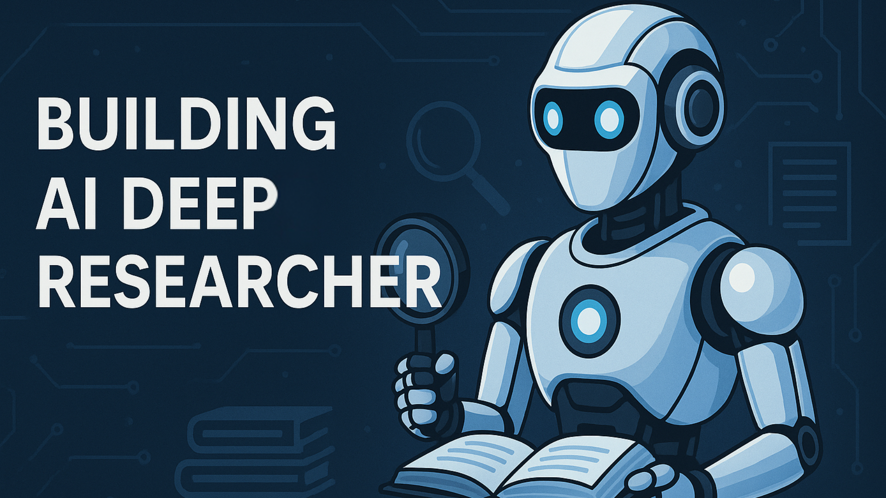

# LAB331: Deep Research with LangChain and DeepSeek R1

Welcome to the Azure Deep Research Workshop! In this hands-on workshop, you'll learn how to build an AI-powered research assistant that can conduct comprehensive web research, analyze and synthesize information, and present findings with illustrative images.

## What You'll Build

This workshop will guide you through creating a sophisticated AI research system that leverages Azure OpenAI's powerful reasoning capabilities, web search integration, and a modern responsive UI to deliver comprehensive research results.

By the end of this workshop, you'll have built a complete research application that can:

- Process research requests with transparent, real-time AI reasoning
- Conduct multi-stage web research with knowledge gap identification
- Perform iterative research cycles to build comprehensive knowledge
- Present findings with a professional UI including relevant images
- Deploy as a scalable web application with WebSockets for real-time updates

## Workshop Structure

The workshop is organized into four labs:

1. **Reasoning & Model Thoughts**: Understand how to harness reasoning models and stream their thinking process in real-time
2. **Web Research Integration**: Integrate web search capabilities with query generation and information synthesis
3. **Research Reflection**: Implement knowledge gap identification and iterative research cycles
4. **Launching Your Researcher**: Transform your terminal application into a modern web interface with FastAPI and WebSockets

## Prerequisites

Before starting this workshop, ensure you have:

- Python 3.10+ installed on your machine
- An Azure account with access to Azure OpenAI Service
- A basic understanding of Python programming
- Familiarity with web technologies (HTML, CSS, JavaScript)
- Access to a Tavily API key for web search capability

## Getting Started

To begin the workshop, proceed to the [Getting Started](getting-started.md) section to set up your environment and install the necessary dependencies.

Let's start building your AI-powered research assistant!
