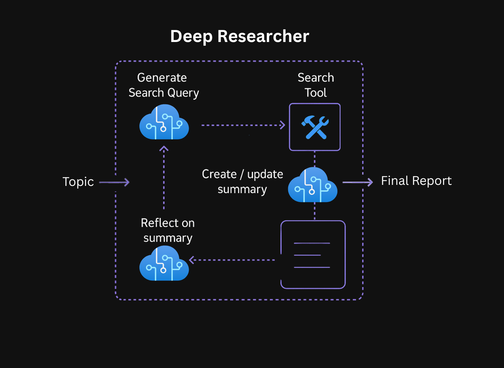

# LAB331: Deep Research with LangChain and DeepSeek R1

## Introduction 

Welcome to Lab 331! In this hands-on workshop, you'll learn how **Reasoning Models**, like DeepSeek R1 work and how to use them for deep research. 

{ height="400"}

## What You'll Build

We'll walk through how to build a research assistant that can conduct comprehensive web research, analyze and synthesize information, and present it's findings.

### The complete iterative deep research process includes:

1. **Query Generation**: Query generation based on the users research topic input 
2. **Web Search**: Searching the web based on the generated query
3. **Summarization**: Summarization of the web search results into a report
4. **Knowledge Gap Identification**: Reflection on the summary and identification of specific knowledge gaps to fill
5. **Follow-up search cycles**: Iterative search and reflection cycles based on identified gaps
6. **Final Report**: Synthesis of all findings into a comprehensive report

## What You'll Learn

This workshop has been built to teach you foundational concepts for using reasoning models. To view the full application code see the [Deep Research Azure Sample](https://github.com/Azure-Samples/deepresearch). For a more in depth understanding of how reasoning models work read [this article](https://techcommunity.microsoft.com/blog/azure-ai-services-blog/everything-you-need-to-know-about-reasoning-models-o1-o3-o4-mini-and-beyond/4406846). 

### By the end of this workshop, you'll have learnt:

- What a reasoning model is and how to use DeepSeek R1
-  How to use reasoning models with tools like [Tavily](https://app.tavily.com) web search for optimum search results
- What [LangGraph](https://www.langchain.com/langgraph) is and how to implement reflection style archictecture with it
- How to use LangGraph to perform iterative research cycles to build comprehensive knowledge
- How to deploy the final application

## Workshop Structure

The workshop is organized into four labs:

1. **[Introduction to Reasoning Models](lab-1-introduction-to-reasoning-models.md)**
2. **[Web Research Integration](lab-2-web-research.md)**
3. **[Research Reflection](lab-3-reflection.md)**
4. **[Launching Your Researcher](lab-4-launch-researcher.md)**

## Getting Started

To begin the workshop, proceed to the [Getting Started](getting-started.md) section to set up your environment and install the necessary dependencies.
