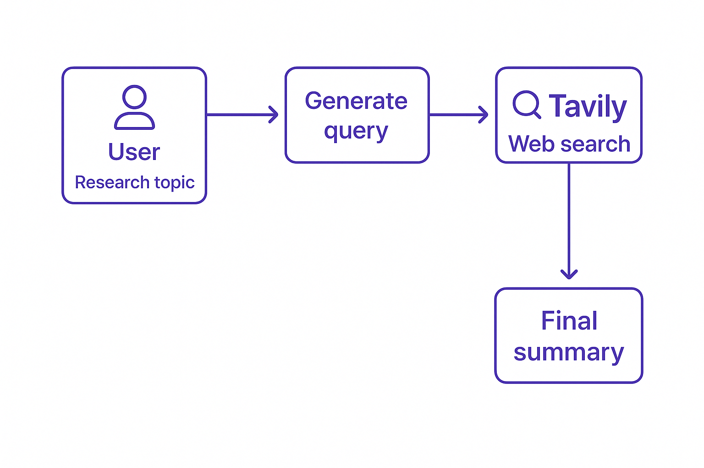

# **Lab 2: Web Research Integration**

## **Why Should We Connect LLMs To The Web?**

So far we have been using DeepSeek R1 to return an answer to our research questions.
While LLMs have extensive knowledge, they have two major limitations:

1. **Training Data Cutoff**: Models only have knowledge up to their training cutoff date
2. **Knowledge Limitations**: No model knows everything, especially about niche or emerging topics

By connecting LLMs to web search capabilities, you can:

- Obtain current information not available during model training
- Get authoritative information from reliable sources
- Research specialized topics where the model's knowledge may be limited
- Find specific data points, statistics, and references

## **The Web Research Process**

To get the best web research results possible we will create a python script that involves three key components:

1. **Query Generation**: Creating effective search queries based on the research topic
2. **Web Search**: Retrieving relevant information from external sources
3. **Summarization**: Integrating the retrieved information into a cohesive summary



## **Query Generation**

We will begin by using DeepSeek R1 to generate an optimal search query based on the users research topic. 
As we saw earlier the system prompt lets the model know how to respond. For the query generator we want the model to return 
the optimizes search query and a brief explanation of why this query is relevant. 

!!! note
    This system prompt and others can be found in the [prompts.py](../../src/prompts.py) file. 

The system prompt for the query writer is as follows:

```python 
query_writer_instructions="""Your goal is to generate a targeted web search query.

<CONTEXT>
Current date: {current_date}
Please ensure your queries account for the most current information available as of this date.
</CONTEXT>

<TOPIC>
{research_topic}
</TOPIC>

<FORMAT>
Format your response as a JSON object with ALL three of these exact keys:
   - "query": The actual search query string
   - "rationale": Brief explanation of why this query is relevant
</FORMAT>

<EXAMPLE>
Example output:
{{
    "query": "machine learning transformer architecture explained",
    "rationale": "Understanding the fundamental structure of transformer models"
}}
</EXAMPLE>

Provide your response in JSON format. Do not include any tags or backticks. Only return
Json like in the example:"""
```

## **Web Search**

The generated query is then used to perform a web search using the Tavily API. 
This is the code required:

```python
def perform_web_search(query):
    """Perform a web search using the Tavily API."""

    search_results = tavily_client.search(query)
    
    for i, result in enumerate(search_results["results"]):
        print(f"**Result {i + 1}**")
        print(f"**Title**: {result['title']}")
        print(f"**Snippet**: {result['content']}")
        print(f"**URL**: {result['url']}\n")

    return search_results
```

Tavily retrieves information from the web about the topic and displays snippets of the results.

!!! tip
    Tavily offers several options to alter the quality and quantity of the search_results. 
    To specify the number of search results use the `max_results` parameter. 
    To determine the depth of the search set the `search_depth` parameter to `basic` or `advanced`. 
    Advanced returns higher quality results but takes longer. 

## **Lab Excercise**

1. Examine the code in [lab2a_web_research.py](../../src/lab2a_web_research.py).

2. Run the following command in the terminal to try out web search:

    ```powershell
    python lab2a_web_research.py
    ```
    
3. Update the code to test out returning more than one result and try the advanced search!

## Next Steps

You have now learnt how to use a reasoning model with a search tool. The next step is to summarize the web results into a cohesive summary. 
DeepSeek can be used to create the summary and then reflect on it so gaps can be identified and filled. To learn how this is done using LangGraph, move on to [Lab 3: Research Reflection](lab-3-reflection.md).