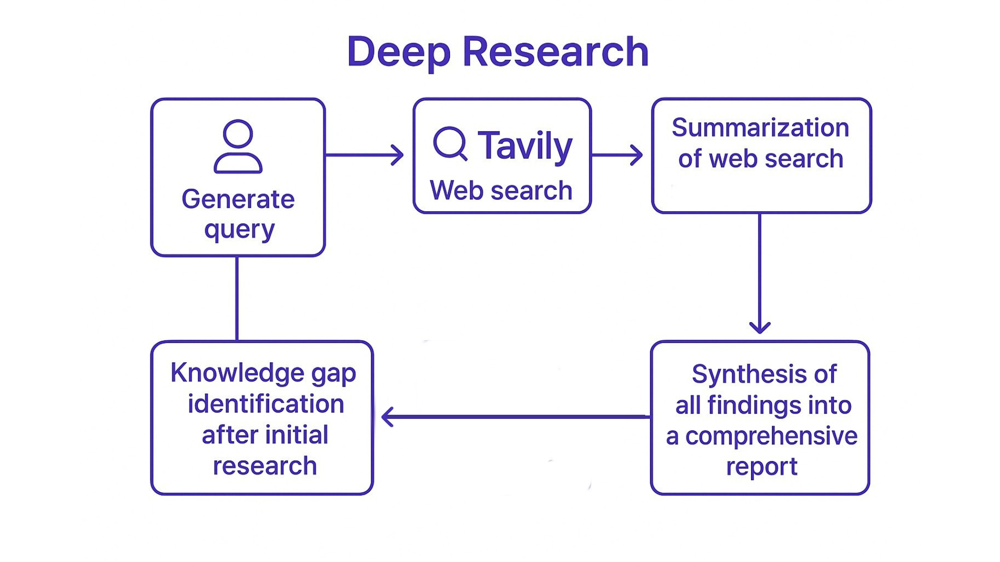

# **Lab 3: Research Reflection**

## **Understanding Research Reflection**

Even with web search capabilities, a single research cycle often leaves important questions unanswered. Real research is iterative - findings from initial searches reveal what else we need to know.

Research reflection involves:

1. **Knowledge Gap Identification**: Analyzing current information to find what's missing
2. **Follow-up Query Generation**: Creating targeted follow-up questions to fill these gaps
3. **Multiple Research Cycles**: Conducting iterative research to build comprehensive knowledge
4. **Progressive Synthesis**: Combining findings from all iterations into a coherent whole

The complete iterative **'Deep Research'** process looks like this:



## **When To Use An AI Framework**

This process will give us the high quality results but veers away from the linear flow of the scripts we saw in the previous labs. As AI workflows become more complex, developers need to write code that takes into account things like states, conditional branching, tool use and more. To simplify this process it is often useful to use an AI framework. 

[LangGraph](https://www.langchain.com/langgraph) is a Python framework that lets you build stateful, multi-step reasoning workflows using large language models by representing them as graphs. It’s built on top of LangChain and designed for more complex use cases.

## **Using LangGraph For The Iterative Research Process**

### ****States in LangGraph**

One of the things to note about this process is that we have to keep track of the **state** of the running summary and web results so we can update them with each iteration. LangGraph allows us to do this by creating an overall `State` class with different variables that can be updated and passed between steps. 
For this project we create a `SummaryState` that looks like this:


```python
class SummaryState:
    research_topic: str = field(default=None) # Report topic     
    search_query: str = field(default=None) # Search query
    rationale: str = field(default=None) # rationale for the search query
    web_research_results: Annotated[list, operator.add] = field(default_factory=list) 
    sources_gathered: Annotated[list, operator.add] = field(default_factory=list) 
    research_loop_count: int = field(default=0) # Research loop count
    running_summary: str = field(default=None) # Final report
    knowledge_gap: str = field(default=None) # Knowledge gap
```

This state is what is passed between the different functions and allows us at anytime to check any variable. 

!!! tip
    🧠 Key Concepts in LangGraph:

    **Nodes** = individual steps that can update the state in some way (e.g. get web research results, retrieve docs, update memory)

    **Edges** = the transitions between those steps, which can depend on model outputs

    **State** = shared memory or variables passed between steps

    **Loops & Branching (Conditional Edges)** = supports revisiting steps or changing paths based on conditions

### **Nodes And Edges in LangGraph**

In order for us to carry out iterative research we need a way to be able to know when to keep researching and when to return the final report. We can create a function that contains some condition that decides which route to take. In LangGraph such a function is called a **conditional edge**. For our Deep Researcher we will set the simple condition of whether research has been done 3 times (remember 0 is included). The function looks like this:

```python 
def route_research(state: SummaryState):
    if state.research_loop_count <= 1:
        return "web_research"
    else:
        return "finalize_summary" 
```

If the `web_research` function is returned LangGraph will call that function, passing the follow_up_query to it. This query would have been generated by the `identify_knowledge_gaps` function which uses DeepSeek R1 to reflect on the current summary and to identify knowledge gaps to fill. This function like most of the ones we've seen so far can update the SummaryState and so is considered a Node. 

## **Lab Excercise**

1. Examine the **reflection_instructions** in [prompts.py](../../src/prompts.py) and see how this is used to prompt the model to generate a thoughtful follow up query.
2. Examine the code in [lab3a_reflection.py](../../src/lab3a_reflection.py) to see a simplfied version of how a Deep Researcher graph would be built 
3. Run the following command to visualize the graph using LangGraph's in built function:

    ```python
    python lab3a_reflection.py
    ```

    you should see a mermaid diagram like this:
    

## **Putting it all together**

## **Lab Excercise**

1. To see the full researcher in action run the following command:

    ```python
    python lab3b_reflection.py
    ```

## **Next Steps**

We can now put everything we've learnt into practice by building a Deep Rearch application. Move on to [Lab 4: Launching Your Researcher](lab-4-launch-researcher.md).