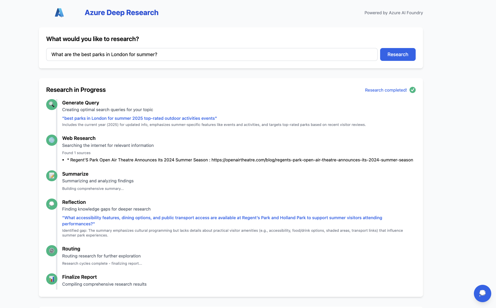

# **Lab 4: Launching Your Research Assistant**

In this lab, you'll transform your terminal-based research assistant into a professional web application!

## **Application Overview**

The web application uses:

1. **Backend**: FastAPI Python server with WebSocket support
2. **Frontend**: HTML/CSS/JavaScript with Tailwind CSS for styling

Your launched application should look like this when running your research: 



## **Running the Application**

To launch the web application:

1. Install the required dependencies:

```bash
pip install -r requirements.txt
```

2. Start the FastAPI server:

```bash
uvicorn app.main:app --reload
```

3. Open your browser and navigate to:

```
http://localhost:8000
```

## **Using the Web Interface**

The web application features a clean, intuitive interface:

1. **Research Input**: Enter a research topic in the input field and click "Research"
2. **Progress Tracking**: Watch as the system progresses through each research step
3. **Live Updates**: See real-time updates as the research is conducted
4. **Thinking Process**: Click the thought bubble icon to view the AI's reasoning process
5. **Final Report**: View the comprehensive research report with citations

## **Congratulations!**

You've successfully built and deployed a Deep Researcher using DeepSeek R1, LangChain, and FastAPI!

Checkout the [Summary](summary.md) to see an overview of what you learnt and navigate to the [Resources](resources.md) page for links to access this lab and more at home! 